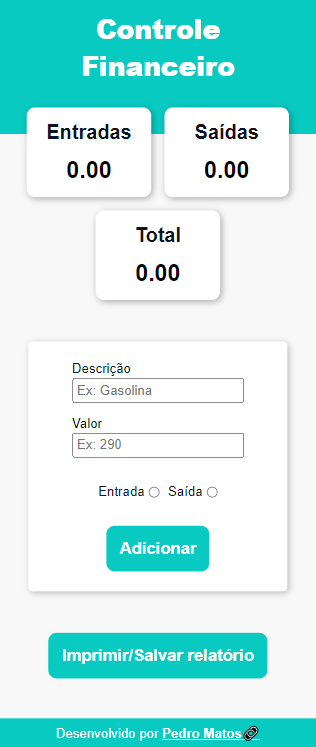
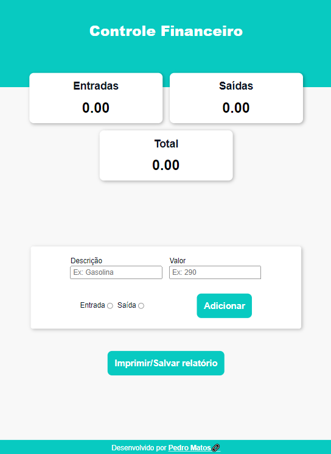
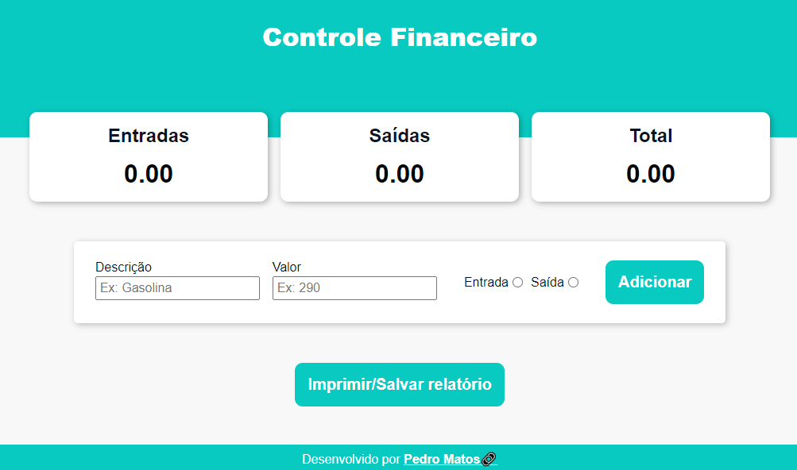

# Projeto Controle Financeiro 
Uma aplicação web para auxiliar suas finanças

## Índice
- <a href="#funcionalidades-do-projeto">Funcionalidades do Projeto</a>
- <a href="#design-do-projeto">Design do Projeto</a>
- <a href="#abrir-projeto">Abrir Projeto</a>
- <a href="#tecnologias-utilizadas">Tecnologias Utilizadas</a>
- <a href="#autor">Autor</a>

## Funcionalidades do Projeto
- [x] Registra valores de entrada e saída
- [x] Registra a descrição da movimentação
- [x] Faz o extrato contento as informações sobre a movimentação
- [x] Opção de salvar o extrato como PDF no computador do usuário
- [x] Opção de impressão do extrato

## Design do Projeto
Visualização em telas pequenas  

Visualização em telas médias  

Visualização em telas grandes  

## Abrir Projeto
[Link demonstração]()  
Clique no link acima para acessar a aplicação

## Tecnologias Utilizadas

  React
  JavaScript
  CSS
  HTML

## Autor
Olá meu nome é Pedro Matos.  
Tenho 20 anos, moro na Bahia e sou apaixonado pelo ambiente de tecnologia. Adoro acompanhar o contexto tecnológico como um todo, tendências e lançamentos globais sobre programas, softwares, aparelhos, jogos, IA, etc. E venho estudando constantemente sobre programação.  

Entre em contato comigo:  

<a href="https://www.linkedin.com/in/pedro-matos-7b8a50287" target="_blank" 
rel="noopener noreferrer">LinkedIn<a/>  

<pedroheunapolis@gmail.com>